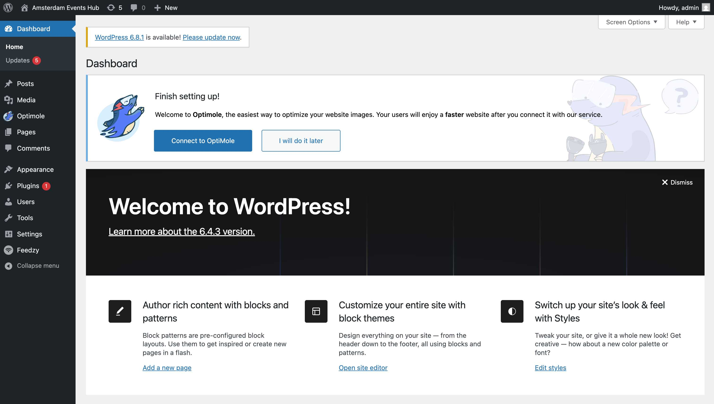
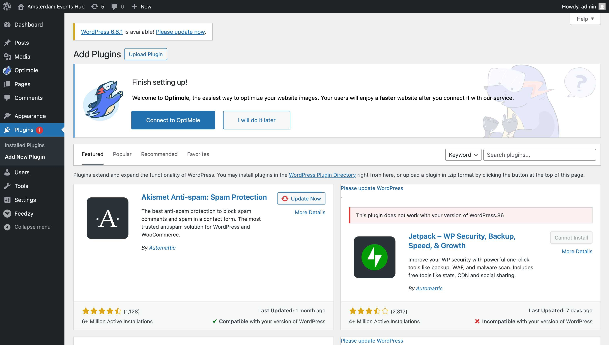
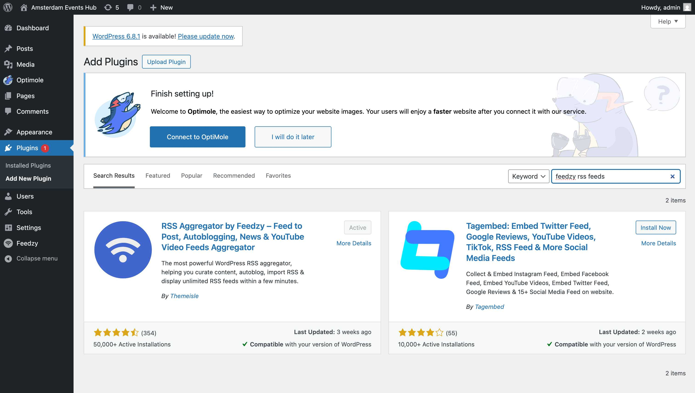
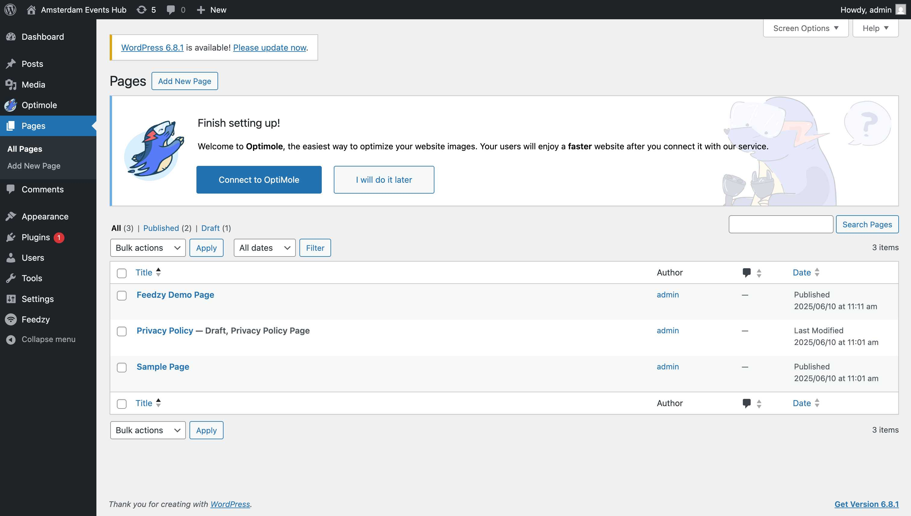
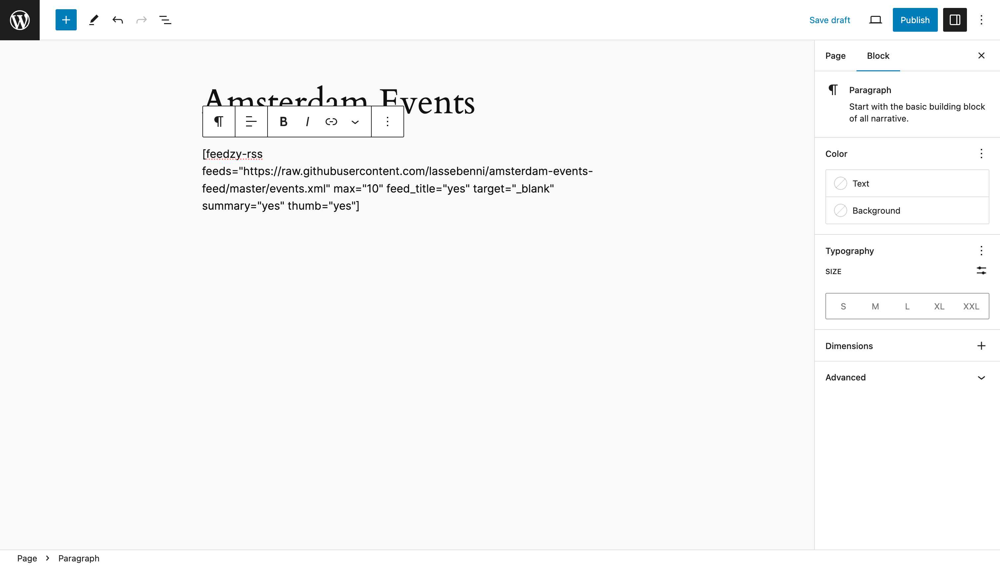
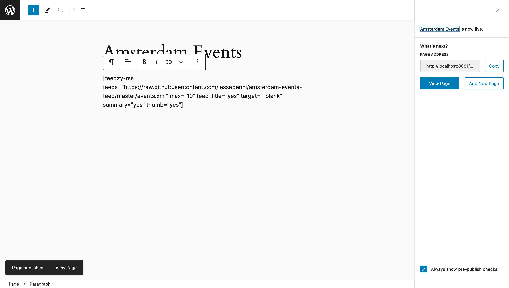
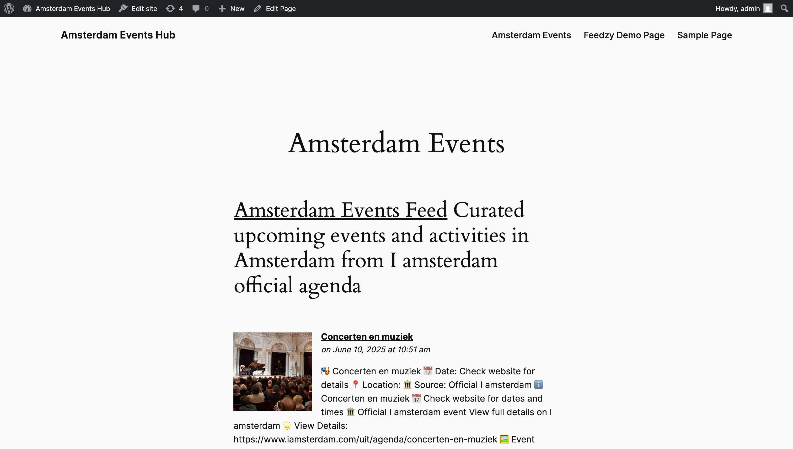

# WordPress Admin Guide: Setting up Amsterdam Events RSS Feed

This comprehensive guide walks WordPress administrators through the complete process of adding the Amsterdam Events RSS feed to their WordPress site using the Feedzy RSS Feeds plugin.

## 📋 Prerequisites

- WordPress 5.0 or higher
- Administrator access to your WordPress site
- Internet connection to install plugins

## 🎯 Overview

This guide will help you:
1. Install and activate the Feedzy RSS Feeds plugin
2. Create a dedicated page for displaying Amsterdam Events
3. Configure the RSS feed using a simple shortcode
4. Clean up default WordPress content for a professional look
5. Publish and view the final, polished result

---

## Step 1: Access WordPress Admin Dashboard

First, log into your WordPress admin area.



**What you see:**
- Clean WordPress admin dashboard
- Main navigation menu on the left
- Dashboard overview and updates available

---

## Step 2: Install Feedzy RSS Feeds Plugin

Navigate to **Plugins > Add New Plugin** from the left sidebar.



**Actions:**
1. Click on "Add New Plugin" in the plugins menu
2. You'll see the plugin installation page with search functionality

### Search for Feedzy

In the search box, type: `feedzy rss feeds`



**What you see:**
- Search results showing RSS plugins
- **"RSS Aggregator by Feedzy"** - this is the plugin we need
- The plugin shows as "Active" if already installed, or "Install Now" if not

### Install and Activate

1. Click **"Install Now"** on the "RSS Aggregator by Feedzy" plugin
2. After installation, click **"Activate"**
3. The plugin will be activated and ready to use

---

## Step 3: Create a New Page for Amsterdam Events

Navigate to **Pages > All Pages** to see your existing pages.



**What you see:**
- A list of default pages (e.g., "Sample Page", "Privacy Policy"). These can be deleted later for a cleaner site.
- The "Add New Page" button at the top, which you will use next.
- The standard WordPress page management interface.

### Create New Page

Click on **"Add New Page"** to create the page for the Amsterdam Events.


**WordPress Block Editor Interface:**
- **Title field** at the top (currently shows "Add title")
- **Content area** with "Type / to choose a block"
- **Settings panel** on the right side
- **Publish controls** in the top-right

---

## Step 4: Configure the Page Content

### Add Page Title

In the "Add title" field, enter: **`Amsterdam Events`**

### Add Feedzy Shortcode

1. Click in the content area where it says "Type / to choose a block"
2. This will create a paragraph block
3. Enter the following shortcode:

```
[feedzy-rss feeds="https://raw.githubusercontent.com/lassebenni/amsterdam-events-feed/master/events.xml" max="10" feed_title="yes" target="_blank" summary="yes" thumb="yes"]
```



**Shortcode Parameters Explained:**
- `feeds="..."` - The URL of the Amsterdam Events RSS feed
- `max="10"` - Maximum number of events to display
- `feed_title="yes"` - Show the feed title
- `target="_blank"` - Open links in new tabs
- `summary="yes"` - Display event descriptions
- `thumb="yes"` - Show event images/thumbnails

---

## Step 5: Publish the Page

### Publish Process

1. Click the **"Publish"** button in the top-right
2. WordPress will show a pre-publish checklist
3. Click **"Publish"** again to confirm



**Success indicators:**
- "Page published" notification appears
- "Amsterdam Events is now live" message
- "View Page" link becomes available

---

## Step 6: View the Final Result

Click **"View Page"** to see your Amsterdam Events page live on your website.



**🎉 Success! What you'll see:**
- **A clean page layout** with "Amsterdam Events" as the title.
- **The feed title and description** pulled directly from the RSS source.
- **A beautifully formatted list of Amsterdam events** including:
  - ✅ **Clickable event titles** that open in new tabs
  - ✅ **Event categories** (Concerten en muziek, Festivals, etc.)
  - ✅ **Structured information** with emojis for better readability
  - ✅ **Direct links** to the official I amsterdam event pages
  - ✅ **Professional formatting** with proper spacing and styling.

---

## Step 7: Clean Up Your WordPress Site (Recommended)

For a professional-looking website, it's best to remove the default content that comes with a new WordPress installation.

### Delete Default Pages

1. Navigate to **Pages > All Pages**.
2. Select the checkboxes next to "Sample Page" and any other pages you don't need.
3. From the "Bulk actions" dropdown, select **"Move to Trash"** and click **"Apply"**.

### Delete Default Post

1. Navigate to **Posts > All Posts**.
2. Hover over "Hello world!" and click the **"Trash"** link.

This cleanup ensures that your site only displays the content you've created, providing a better experience for your visitors.

---

## 🔧 Customization Options

### Shortcode Parameters You Can Modify

```
[feedzy-rss feeds="RSS_URL" max="NUMBER" feed_title="yes/no" target="_blank/_self" summary="yes/no" thumb="yes/no" refresh="TIME"]
```

**Common Parameters:**
- `max="5"` - Show only 5 events
- `refresh="2_hours"` - Set the cache refresh time. Valid units are `mins`, `hours`, and `days` (e.g., `30_mins`, `1_hours`, `1_days`).
- `feed_title="no"` - Hide the feed title
- `summary="no"` - Hide descriptions
- `thumb="no"` - Hide images

### Example Variations

**Minimal display (titles only):**
```
[feedzy-rss feeds="https://raw.githubusercontent.com/lassebenni/amsterdam-events-feed/master/events.xml" max="5" feed_title="no" summary="no" thumb="no"]
```

**More events with a 30-minute cache:**
```
[feedzy-rss feeds="https://raw.githubusercontent.com/lassebenni/amsterdam-events-feed/master/events.xml" max="20" refresh="30_mins"]
```

### Feed Not Loading or Not Updating
- **Check internet connection** - Ensure your server can access external URLs.
- **Verify RSS URL** - Make sure the feed URL is correct and accessible in your browser.
- **Clear a stubborn cache** - If the feed appears stuck on old content, add `refresh="1_mins"` to the shortcode. This forces Feedzy to fetch the latest version, bypassing its cache. This is the most effective way to troubleshoot update issues.

### Formatting Issues
- **Theme conflicts** - Some WordPress themes may override RSS styling.
- **Plugin conflicts** - Deactivate other plugins temporarily to test
- **Shortcode syntax** - Ensure all quotes and parameters are correct

### No Events Showing
- **Feed source** - Verify the RSS feed has content
- **Plugin activation** - Ensure Feedzy is properly activated
- **WordPress permissions** - Check if external requests are allowed

---

## 📚 Additional Resources

### WordPress Resources
- [WordPress Plugin Directory](https://wordpress.org/plugins/)
- [WordPress Documentation](https://wordpress.org/documentation/)

### Feedzy Documentation
- [Feedzy RSS Feeds Plugin](https://wordpress.org/plugins/feedzy-rss-feeds/)
- [Feedzy Shortcode Parameters](https://docs.themeisle.com/article/658-feedzy-rss-feeds-documentation)

### Amsterdam Events
- **RSS Feed URL:** `https://raw.githubusercontent.com/lassebenni/amsterdam-events-feed/master/events.xml`
- **Source:** Official I amsterdam agenda
- **Update frequency:** Regular updates from I amsterdam website

---

## ✅ Quick Checklist

Use this checklist to ensure you've completed all steps for a production-ready site:

- [ ] ✅ Logged into WordPress admin
- [ ] ✅ Installed and activated the Feedzy RSS Feeds plugin
- [ ] ✅ Created a new page titled "Amsterdam Events"
- [ ] ✅ Added the Feedzy shortcode with the correct RSS URL
- [ ] ✅ Published the "Amsterdam Events" page
- [ ] ✅ **Deleted default pages** (e.g., Sample Page, Privacy Policy)
- [ ] ✅ **Deleted default post** ("Hello world!")
- [ ] ✅ Verified the final events page displays correctly
- [ ] ✅ Tested that event links open properly

---

## 🎯 Final Notes

**Congratulations!** You have successfully set up the Amsterdam Events RSS feed on your WordPress site. Your visitors can now:

- **Browse current Amsterdam events** from the official I amsterdam source
- **Click directly to event details** on the I amsterdam website  
- **See well-formatted event information** with dates, categories, and descriptions
- **Access fresh content** that updates automatically from the RSS feed

The Feedzy RSS Feeds plugin will automatically fetch new events as they're added to the Amsterdam Events feed, keeping your site's content fresh and up-to-date.

---

*Guide created with ❤️ for WordPress administrators*
*Last updated: June 10, 2025* 