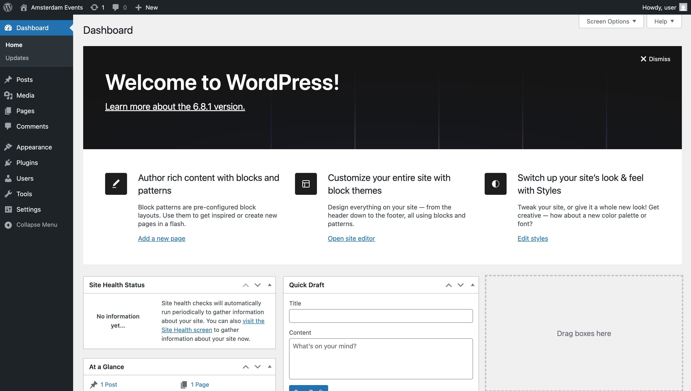

# WordPress Admin Guide: Setting up Amsterdam Events RSS Feed

This comprehensive guide walks WordPress administrators through the complete process of adding the Amsterdam Events RSS feed to their WordPress site using the Feedzy RSS Feeds plugin.

## 📋 Prerequisites

- WordPress 5.0 or higher
- Administrator access to your WordPress site
- Internet connection to install plugins

## 🎯 Overview

This guide will help you:
1. Install and activate the Feedzy RSS Feeds plugin
2. Create a dedicated page for displaying Amsterdam Events
3. Configure the RSS feed using a simple shortcode
4. Clean up default WordPress content for a professional look
5. Publish and view the final, polished result

---

## Step 1: Access WordPress Admin Dashboard

First, log into your WordPress admin area.



**What you see:**
- Clean WordPress admin dashboard
- Main navigation menu on the left
- Dashboard overview and updates available

---

## Step 2: Install Feedzy RSS Feeds Plugin

Navigate to **Plugins > Add New** from the left sidebar.


**Actions:**
1. Click on "Add New" in the plugins menu
2. You'll see the plugin installation page with search functionality

### Search for Feedzy

In the search box, type: `feedzy rss feeds`


**What you see:**
- Search results showing RSS plugins
- **"Feedzy RSS Feeds"** - this is the plugin we need
- The plugin shows as "Active" if already installed, or "Install Now" if not

### Install and Activate

1. Click **"Install Now"** on the "Feedzy RSS Feeds" plugin
2. After installation, the button will change to **"Activate"**.


3. Click **"Activate"** to enable the plugin.

---

## Step 3: Clean Up Default Pages

For a cleaner site, it's best to remove the default pages.

Navigate to **Pages > All Pages**.


**Actions:**
1.  Move the "Sample Page" and "Privacy Policy" pages to the Trash.

---

## Step 4: Create the Events Page

Navigate to **Pages > Add New** to create the page for the Amsterdam Events.


### Add Page Title and Shortcode

1.  In the "Add title" field, enter: **`Amsterdam Events`**
2.  In the content area, enter the following shortcode:

```
[feedzy-rss feeds="https://raw.githubusercontent.com/lassebenni/amsterdam-events-feed/master/events.xml" refresh="1_mins" feed_title="no" meta="no" summary="yes" thumb="yes" size="200px"]
```


**Shortcode Parameters Explained:**
-   `feeds="..."` - The URL of the Amsterdam Events RSS feed.
-   `refresh="1_mins"` - Forces the feed to refresh every minute, ensuring you always see the latest content.
-   `feed_title="no"` - Hides the main feed title for a cleaner look.
-   `meta="no"` - Hides metadata like author and date.
-   `summary="yes"` - Displays the event descriptions.
-   `thumb="yes"` - Shows event images.
-   `size="200px"` - Sets the thumbnail size.

---

## Step 5: Publish the Page

1.  Click the **"Publish"** button in the top-right.
2.  Click **"Publish"** again to confirm.


---

## Step 6: View the Final Result

Click **"View Page"** to see your Amsterdam Events page live on your website.


**🎉 Success! What you'll see:**
- A beautifully formatted list of Amsterdam events with images and descriptions.
- Event descriptions are translated into English.
- Links open in a new tab for a better user experience.

---

## 🔧 Troubleshooting

-   **Feed Not Loading or Updating:** The `refresh="1_mins"` parameter in the shortcode is the most effective way to bypass caching issues and force the feed to update.
-   **Formatting Issues:** Theme or plugin conflicts can sometimes affect styling. The CSS included in the feed is designed to be robust, but you can add custom CSS in your theme if needed.

---

## ✅ Quick Checklist

-   [ ] ✅ Logged into WordPress admin.
-   [ ] ✅ Installed and activated the Feedzy RSS Feeds plugin.
-   [ ] ✅ Deleted default pages.
-   [ ] ✅ Created a new page titled "Amsterdam Events".
-   [ ] ✅ Added the correct Feedzy shortcode.
-   [ ] ✅ Published the "Amsterdam Events" page.
-   [ ] ✅ Verified the final events page displays correctly with translated descriptions.

---

## 🎯 Final Notes

**Congratulations!** You have successfully set up the Amsterdam Events RSS feed on your WordPress site. Your visitors can now:

- **Browse current Amsterdam events** from the official I amsterdam source
- **Click directly to event details** on the I amsterdam website  
- **See well-formatted event information** with dates, categories, and descriptions
- **Access fresh content** that updates automatically from the RSS feed

The Feedzy RSS Feeds plugin will automatically fetch new events as they're added to the Amsterdam Events feed, keeping your site's content fresh and up-to-date.

---

*Guide created with ❤️ for WordPress administrators*
*Last updated: June 10, 2025* 